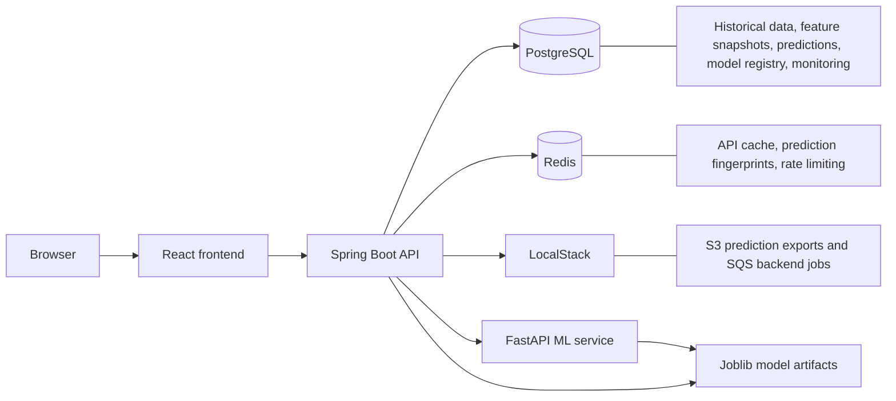
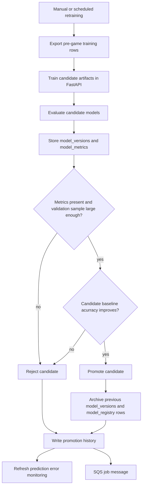
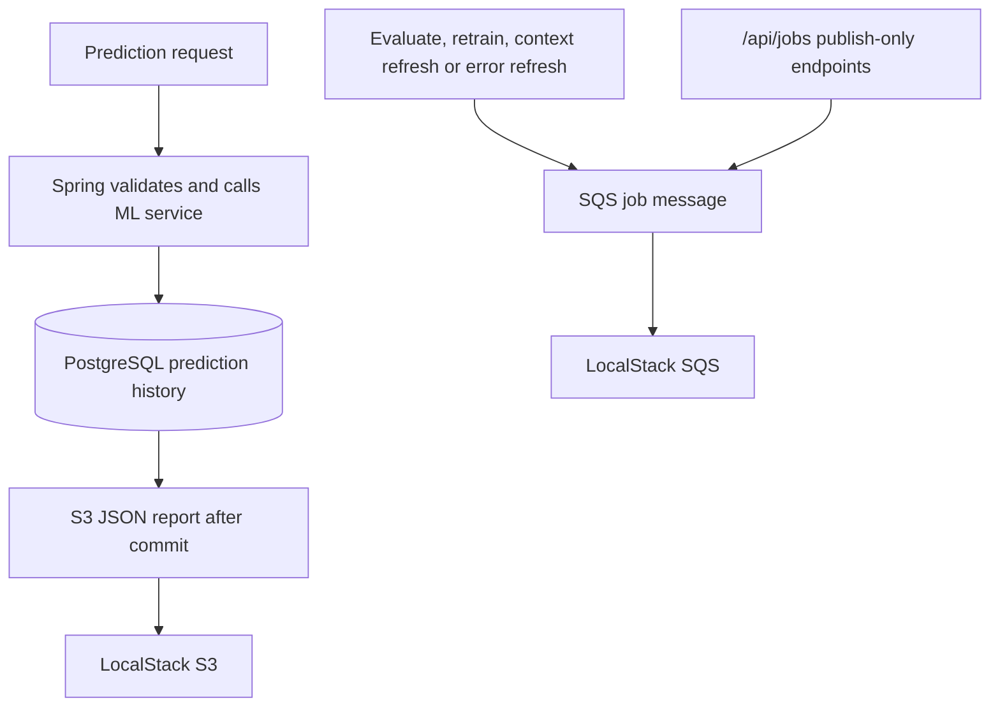

# Architecture

This project uses Spring Boot as the heart of the system . The frontend never 
calls the Machine Learning service (FastAPI) directly.

## Leakage Prevention

The model should NOT use the same game box score data for the same game's
prediction. The feature tables include:

- `snapshot_time`
- `generated_at`
- `data_cutoff_time`
- `game_id`
- `player_id` or `team_id` when applicable
- `model_version_id` when used by a prediction

The feature pipeline will only aggregate games where `game_date_time_est` is
earlier than the target game's cutoff time. Or in simpler words, before the game begins.

## ML Architecture

Scheduled retraining uses the same service path as manual
`POST /api/model/retrain`. It is currently disabled by default and can be enabled with
`NBA_MODEL_RETRAINING_ENABLED=true` in application.properties.

## Cloud Architecture

LocalStack hobby plan was used for the local AWS compatibility. The app uses regular AWS SDK
clients, externalized endpoint settings, bucket settings, queue settings and test credentials.

## Runtime Boundaries

- The browser talks to React and Spring Boot.
- Spring Boot owns API validation, persistence, caching, rate limiting, model
  registry state, cloud exports, async job messages and monitoring records, basically most of it.
- FastAPI owns model training, model loading, inference and evaluation.
- PostgreSQL is the good old durable source of truth.
- Redis owns the caching and rate limiting management.
- LocalStack emulates AWS S3 and SQS locally for the cloud infrastructure.
